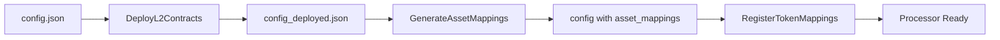

# Forge Scripts

Solidity scripts for deploying and configuring the migration contracts using Foundry.

## Scripts Overview

| Script | Purpose | Executed By |
|--------|---------|-------------|
| `DeployL2Contracts.s.sol` | Deploy VaultWithdrawalProcessor and VaultEscapeProofVerifier | Deployer |
| `GenerateAssetMappings.s.sol` | Generate asset mappings by querying bridge contract | Utility (offline) |
| `RegisterTokenMappings.s.sol` | Register token mappings on the processor | TOKEN_MAPPING_MANAGER |

## Typical Workflow



### Step 1: Deploy Contracts

Deploy the `VaultWithdrawalProcessor` and `VaultEscapeProofVerifier` contracts.

```bash
DEPLOYMENT_CONFIG_FILE=config/mainnet.json \
DEPLOYMENT_OUTPUT_FILE=config/mainnet_deployed.json \
forge script script/DeployL2Contracts.s.sol \
    --rpc-url $RPC_URL \
    --broadcast \
    --slow
```

**Output:** Creates `config/mainnet_deployed.json` with deployed addresses:
- `vault_verifier`: VaultEscapeProofVerifier address
- `withdrawal_processor`: VaultWithdrawalProcessor address

### Step 2: Generate Asset Mappings

Query the bridge contract to populate `asset_mappings` in the config.

```bash
TOKENS_FILE=config/tokens.json \
DEPLOYMENT_CONFIG_FILE=config/mainnet_deployed.json \
BRIDGE_CONTRACT=0x... \
ETH_MAPPING=0x... \
forge script script/GenerateAssetMappings.s.sol \
    --rpc-url $RPC_URL
```

**Output:** Updates `asset_mappings` in the config file in place.

### Step 3: Register Token Mappings

Register the token mappings on the deployed processor (requires `TOKEN_MAPPING_MANAGER` role).

```bash
DEPLOYMENT_CONFIG_FILE=config/mainnet_deployed.json \
forge script script/RegisterTokenMappings.s.sol \
    --rpc-url $RPC_URL \
    --broadcast
```

---

## Script Details

### DeployL2Contracts.s.sol

Deploys the core L2 contracts for the migration system.

**Environment Variables:**

| Variable | Required | Description |
|----------|----------|-------------|
| `DEPLOYMENT_CONFIG_FILE` | Yes | Path to input config JSON |
| `DEPLOYMENT_OUTPUT_FILE` | Yes | Path to write output config with deployed addresses |

**Config File Requirements:**

```json
{
  "allow_root_override": true,
  "vault_verifier": "0x0000...",  // Set to 0x0 to deploy new verifier
  "operators": {
    "pauser": "0x...",
    "unpauser": "0x...",
    "disburser": "0x...",
    "defaultAdmin": "0x...",
    "accountRootManager": "0x...",
    "vaultRootManager": "0x...",
    "tokenMappingManager": "0x..."
  },
  "lookup_tables": ["0x...", ...]  // 63 addresses
}
```

**Notes:**
- Use `--slow` or `--batch-size 1` for Tenderly to ensure correct deployment order
- If `vault_verifier` is zero address, a new `VaultEscapeProofVerifier` is deployed

---

### GenerateAssetMappings.s.sol

Generates the `asset_mappings` array by querying a bridge contract for zkEVM token addresses.

**Environment Variables:**

| Variable | Required | Description |
|----------|----------|-------------|
| `TOKENS_FILE` | Yes | Path to JSON file with token list |
| `DEPLOYMENT_CONFIG_FILE` | Yes | Path to config file (updated in place) |
| `BRIDGE_CONTRACT` | Yes | Address of contract with `rootTokenToChildToken(address)` |
| `ETH_MAPPING` | Yes | zkEVM address for ETH ERC20 (network-specific) |

**Tokens File Format:**

```json
[
  {
    "token_int": 123...,
    "quantum": 100000000,
    "token_address": "0x...",
    "ticker_symbol": "TOKEN"
  }
]
```

**Special Cases:**
- `token_address: "eth"` → Uses `ETH_MAPPING` env var
- `ticker_symbol: "IMX"` → Uses `0x0000000000000000000000000000000000000FfF`

---

### RegisterTokenMappings.s.sol

Registers token mappings on an existing `VaultWithdrawalProcessor`.

**Environment Variables:**

| Variable | Required | Description |
|----------|----------|-------------|
| `DEPLOYMENT_CONFIG_FILE` | Yes | Path to config with `withdrawal_processor` and `asset_mappings` |

**Requirements:**
- The signing account must have the `TOKEN_MAPPING_MANAGER` role on the processor
- Config must contain a valid `withdrawal_processor` address
- Config must contain at least one entry in `asset_mappings`

**Config File Requirements:**

```json
{
  "withdrawal_processor": "0x...",
  "asset_mappings": [
    {
      "tokenOnIMX": {
        "id": "123...",
        "quantum": 100000000
      },
      "tokenOnZKEVM": "0x..."
    }
  ]
}
```

---

## Config File Flow

```
config.json                          # Initial config with operators, lookup_tables
    │
    ▼ DeployL2Contracts.s.sol
    │
config_deployed.json                 # + vault_verifier, withdrawal_processor
    │
    ▼ GenerateAssetMappings.s.sol
    │
config_deployed.json                 # + asset_mappings (updated in place)
    │
    ▼ RegisterTokenMappings.s.sol
    │
    ✓ Token mappings registered on-chain
```
