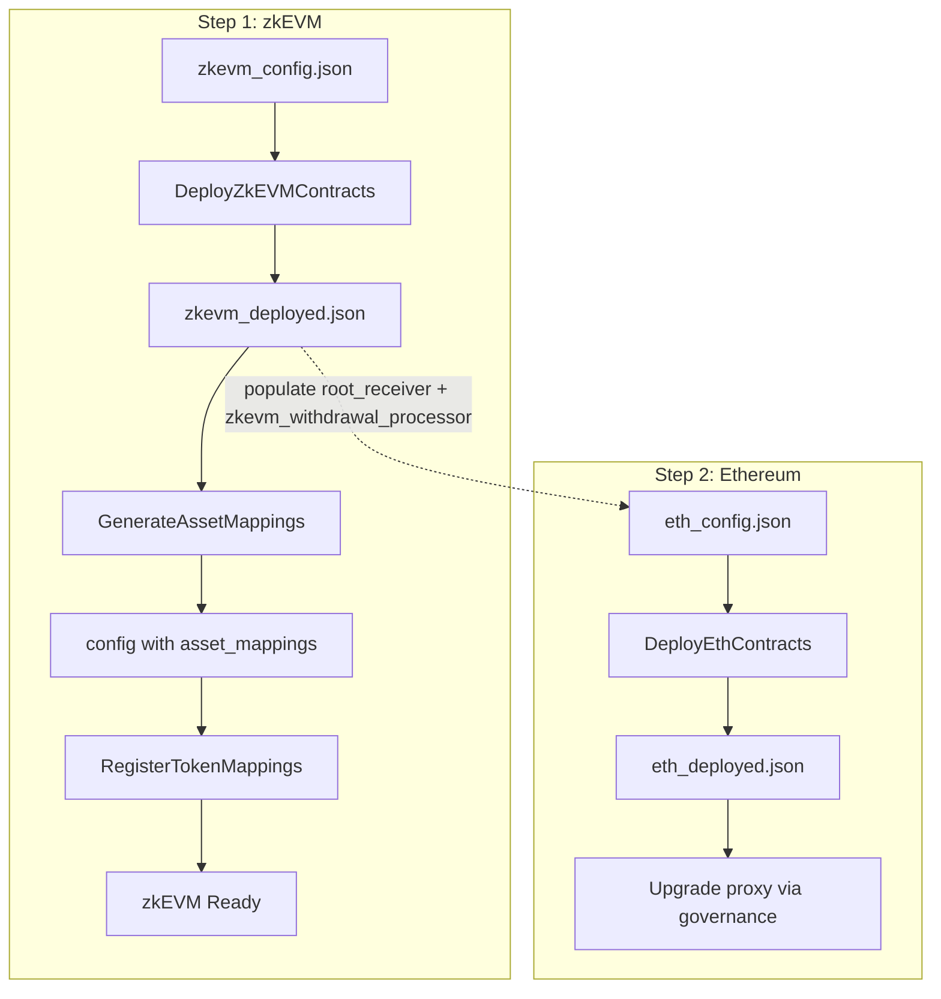

# Forge Scripts

Solidity scripts for deploying and configuring the migration contracts using Foundry.

## Scripts Overview

| Script | Chain | Purpose | Executed By |
|--------|-------|---------|-------------|
| `DeployZkEVMContracts.s.sol` | zkEVM | Deploy VaultEscapeProofVerifier, VaultRootReceiverAdapter, VaultWithdrawalProcessor | Deployer |
| `DeployEthContracts.s.sol` | Ethereum | Deploy VaultRootSenderAdapter and StarkExchangeMigration implementation (version selected via config) | Deployer |
| `GenerateAssetMappings.s.sol` | - | Generate asset mappings by querying bridge contract | Utility (offline) |
| `VerifyAssetMappings.s.sol` | - | Verify asset mappings against bridge contract | Utility (read-only) |
| `RegisterTokenMappings.s.sol` | zkEVM | Register token mappings on the processor | TOKEN_MAPPING_MANAGER |
| `MigrateHoldings.s.sol` | Ethereum | Migrate token holdings for a given phase via `migrateHoldings()` | Migration Manager |

### Legacy

| Script | Purpose |
|--------|---------|
| `DeployL2Contracts.s.sol` | (Superseded by `DeployZkEVMContracts.s.sol`) Deploys VaultWithdrawalProcessor and VaultEscapeProofVerifier only |

## Cross-Chain Deployment Workflow

Deployment spans two chains with cross-chain dependencies. **zkEVM must be deployed first** since Ethereum contracts reference zkEVM addresses.



### Step 1: Deploy zkEVM Contracts

Deploy `VaultEscapeProofVerifier`, `VaultRootReceiverAdapter`, and `VaultWithdrawalProcessor`.

The script automatically wires intra-chain dependencies:
- `VaultWithdrawalProcessor._vaultProofVerifier` = deployed `VaultEscapeProofVerifier` address
- `VaultWithdrawalProcessor._vaultRootProvider` = deployed `VaultRootReceiverAdapter` address

```bash
DEPLOYMENT_CONFIG_FILE=config/zkevm_config.json \
DEPLOYMENT_OUTPUT_FILE=config/zkevm_deployed.json \
forge script script/DeployZkEVMContracts.s.sol \
    --rpc-url $ZKEVM_RPC_URL \
    --broadcast \
    --slow
```

**Output:** Creates `config/zkevm_deployed.json` with deployed addresses populated in:
- `vault_escape_proof_verifier.address`
- `vault_root_receiver_adapter.address`
- `vault_withdrawal_processor.address`

### Step 2: Populate Ethereum Config with zkEVM Addresses

Before deploying Ethereum contracts, update the Ethereum config with addresses from the zkEVM deployment:

- `vault_root_sender_adapter.root_receiver` = `vault_root_receiver_adapter.address` from zkEVM output
- (For governance upgrade) `VaultWithdrawalProcessor` address from zkEVM output will be needed when calling `StarkExchangeMigration.initialize`

### Step 3: Deploy Ethereum Contracts

Deploy `VaultRootSenderAdapter` and the `StarkExchangeMigration` implementation.

```bash
DEPLOYMENT_CONFIG_FILE=config/eth_config.json \
DEPLOYMENT_OUTPUT_FILE=config/eth_deployed.json \
forge script script/DeployEthContracts.s.sol \
    --rpc-url $ETH_RPC_URL \
    --broadcast \
    --slow
```

**Output:** Creates `config/eth_deployed.json` with deployed addresses populated in:
- `vault_root_sender_adapter.address`
- `stark_exchange_migration.implementation_address`

**Note:** The `StarkExchangeMigration` is deployed as an implementation only (no proxy). The existing StarkEx bridge proxy on-chain must be upgraded to point to this implementation separately (e.g., via governance), at which point `initialize` is called with the appropriate parameters. Set `stark_exchange_migration.version` to `1` for `StarkExchangeMigration` or `2` for `StarkExchangeMigrationV2`.

### Step 4: Generate Asset Mappings (zkEVM)

Query the bridge contract to populate `asset_mappings` in the zkEVM config.

```bash
TOKENS_FILE=config/tokens.json \
DEPLOYMENT_CONFIG_FILE=config/zkevm_deployed.json \
BRIDGE_CONTRACT=0x... \
ETH_MAPPING=0x... \
forge script script/GenerateAssetMappings.s.sol \
    --rpc-url $ZKEVM_RPC_URL
```

**Output:** Updates `asset_mappings` in the config file in place.

### Step 5: Register Token Mappings (zkEVM)

Register the token mappings on the deployed processor (requires `TOKEN_MAPPING_MANAGER` role).

```bash
DEPLOYMENT_CONFIG_FILE=config/zkevm_deployed.json \
forge script script/RegisterTokenMappings.s.sol \
    --rpc-url $ZKEVM_RPC_URL \
    --broadcast
```

---

## Script Details

### DeployZkEVMContracts.s.sol

Deploys the zkEVM contracts for the migration system.

**Environment Variables:**

| Variable | Required | Description |
|----------|----------|-------------|
| `DEPLOYMENT_CONFIG_FILE` | Yes | Path to input config JSON (see `config/sample_zkevm_config.json`) |
| `DEPLOYMENT_OUTPUT_FILE` | Yes | Path to write output config with deployed addresses |

**Config File Structure** (see `config/sample_zkevm_config.json`):

```json
{
  "vault_escape_proof_verifier": {
    "address": "0x0000...",
    "lookup_tables": ["0x...", "...63 addresses..."]
  },
  "vault_root_receiver_adapter": {
    "address": "0x0000...",
    "owner": "0x...",
    "axelar_gateway": "0x..."
  },
  "vault_withdrawal_processor": {
    "address": "0x0000...",
    "allow_root_override": true,
    "operators": {
      "accountRootProvider": "0x...",
      "tokenMappingManager": "0x...",
      "disburser": "0x...",
      "pauser": "0x...",
      "unpauser": "0x...",
      "defaultAdmin": "0x..."
    }
  }
}
```

**Notes:**
- Set any contract's `address` to the zero address (`0x0000...`) to deploy a new instance
- Set a non-zero `address` to skip deployment and use the existing contract
- Use `--slow` or `--batch-size 1` for Tenderly to ensure correct deployment order

---

### DeployEthContracts.s.sol

Deploys the Ethereum contracts for the migration system.

**Environment Variables:**

| Variable | Required | Description |
|----------|----------|-------------|
| `DEPLOYMENT_CONFIG_FILE` | Yes | Path to input config JSON (see `config/sample_eth_config.json`) |
| `DEPLOYMENT_OUTPUT_FILE` | Yes | Path to write output config with deployed addresses |

**Config File Structure** (see `config/sample_eth_config.json`):

```json
{
  "vault_root_sender_adapter": {
    "address": "0x0000...",
    "vault_root_sender": "0x...",
    "root_receiver": "0x...",
    "root_receiver_chain": "immutable",
    "axelar_gas_service": "0x...",
    "axelar_gateway": "0x..."
  },
  "stark_exchange_migration": {
    "version": 2,
    "implementation_address": "0x0000..."
  }
}
```

**Config fields:**
- `vault_root_sender`: The existing StarkEx bridge proxy address on Ethereum
- `root_receiver`: The `VaultRootReceiverAdapter` address on zkEVM (from zkEVM deployment output)
- `root_receiver_chain`: The Axelar chain identifier for zkEVM (e.g., `"immutable"`)
- `axelar_gas_service`: The Axelar gas service contract on Ethereum
- `axelar_gateway`: The Axelar gateway contract on Ethereum

**Notes:**
- Run this script **after** `DeployZkEVMContracts.s.sol`
- The `StarkExchangeMigration` is deployed as implementation only (no proxy deployment)
- Use `--slow` or `--batch-size 1` for Tenderly to ensure correct deployment order

---

### GenerateAssetMappings.s.sol

Generates the `asset_mappings` array by querying a bridge contract for zkEVM token addresses.

**Environment Variables:**

| Variable | Required | Description |
|----------|----------|-------------|
| `TOKENS_FILE` | Yes | Path to JSON file with token list |
| `DEPLOYMENT_CONFIG_FILE` | Yes | Path to config file (updated in place) |
| `BRIDGE_CONTRACT` | Yes | Address of contract with `rootTokenToChildToken(address)` |
| `ETH_MAPPING` | Yes | zkEVM address for ETH ERC20 (network-specific) |

**Tokens File Format:**

```json
[
  {
    "token_int": 123...,
    "quantum": 100000000,
    "token_address": "0x...",
    "ticker_symbol": "TOKEN"
  }
]
```

**Special Cases:**
- `token_address: "eth"` → Uses `ETH_MAPPING` env var
- `ticker_symbol: "IMX"` → Uses `0x0000000000000000000000000000000000000FfF`

---

### RegisterTokenMappings.s.sol

Registers token mappings on an existing `VaultWithdrawalProcessor`.

**Environment Variables:**

| Variable | Required | Description |
|----------|----------|-------------|
| `DEPLOYMENT_CONFIG_FILE` | Yes | Path to config with `withdrawal_processor` and `asset_mappings` |

**Requirements:**
- The signing account must have the `TOKEN_MAPPING_MANAGER` role on the processor
- Config must contain a valid `withdrawal_processor` address
- Config must contain at least one entry in `asset_mappings`

**Config File Requirements:**

```json
{
  "withdrawal_processor": "0x...",
  "asset_mappings": [
    {
      "tokenOnIMX": {
        "id": "123...",
        "quantum": 100000000
      },
      "tokenOnZKEVM": "0x..."
    }
  ]
}
```

---

### VerifyAssetMappings.s.sol

Verifies that the `asset_mappings` in a token mappings config file are consistent with the bridge contract's `rootTokenToChildToken()` results.

For each token in the tokens file, the script:
1. Finds the matching entry in `asset_mappings` (by `token_int` == `tokenOnIMX.id`)
2. Queries `rootTokenToChildToken(token_address)` on the bridge contract
3. Compares the bridge result with `tokenOnZKEVM` in the config

**Environment Variables:**

| Variable | Required | Description |
|----------|----------|-------------|
| `TOKENS_FILE` | Yes | Path to imx_tokens JSON file |
| `DEPLOYMENT_CONFIG_FILE` | Yes | Path to token_mappings JSON file (with `asset_mappings` array) |
| `BRIDGE_CONTRACT` | Yes | Address of contract with `rootTokenToChildToken(address)` |
| `ETH_MAPPING` | Yes | zkEVM address for ETH ERC20 (for the special `"eth"` token) |

**Usage:**

```bash
TOKENS_FILE=config/operate/sandbox/imx_tokens.json \
DEPLOYMENT_CONFIG_FILE=config/operate/sandbox/token_mappings.json \
BRIDGE_CONTRACT=0x... \
ETH_MAPPING=0x... \
forge script script/VerifyAssetMappings.s.sol \
    --rpc-url $RPC_URL
```

**Output:** Prints `PASS`, `FAIL`, or `MISSING` for each token and a summary. This is a read-only script (no broadcast needed).

**Special Cases:**
- `token_address: "eth"` → Expected zkEVM address is `ETH_MAPPING`
- `ticker_symbol: "IMX"` → Expected zkEVM address is `0x0000000000000000000000000000000000000FfF`

---

### MigrateHoldings.s.sol

Calls `migrateHoldings()` on the `StarkExchangeMigration` contract for a given phase. Reads a token phases config, filters by phase number, aggregates amounts for duplicate token addresses, and invokes the migration.

The script simulates by default. Add `--broadcast` to send the transaction on-chain.

**Environment Variables:**

| Variable | Required | Description |
|----------|----------|-------------|
| `PHASES_FILE` | Yes | Path to token phases JSON file |
| `PHASE` | Yes | The phase number to migrate |
| `BRIDGE_FEE` | Yes | Bridge fee in wei to use for each token |
| `MIGRATION_CONTRACT` | Yes | Address of the `StarkExchangeMigration` contract |

**Phases File Format:**

```json
[
  {
    "phase": 2,
    "token_address": "0x...",
    "ticker_symbol": "TOKEN",
    "unquantised_sum": 1000000000000000000
  }
]
```

**Special Cases:**
- `token_address: "eth"` → Mapped to `address(0xeee)` (native ETH on the migration contract)
- Duplicate `token_address` entries within the same phase are aggregated (amounts summed)

**Usage (simulate):**

```bash
PHASES_FILE=config/operate/sandbox/token_phases.json \
PHASE=2 \
BRIDGE_FEE=100000000000000 \
MIGRATION_CONTRACT=0x... \
forge script script/MigrateHoldings.s.sol \
    --rpc-url $ETH_RPC_URL
```

**Usage (broadcast):**

```bash
PHASES_FILE=config/operate/sandbox/token_phases.json \
PHASE=2 \
BRIDGE_FEE=100000000000000 \
MIGRATION_CONTRACT=0x... \
forge script script/MigrateHoldings.s.sol \
    --rpc-url $ETH_RPC_URL \
    --broadcast
```

**Output:** Before executing, the script logs:
1. Every raw entry from the phases file for the selected phase
2. The aggregated `TokenMigrationDetails[]` (unique tokens with summed amounts)
3. The full transaction details: target address, `msg.value`, calldata (hex), and calldata keccak256 hash

**Requirements:**
- The signing account must be the `migrationManager` on the `StarkExchangeMigration` contract
- The signer must have sufficient ETH to cover `BRIDGE_FEE * num_tokens`
